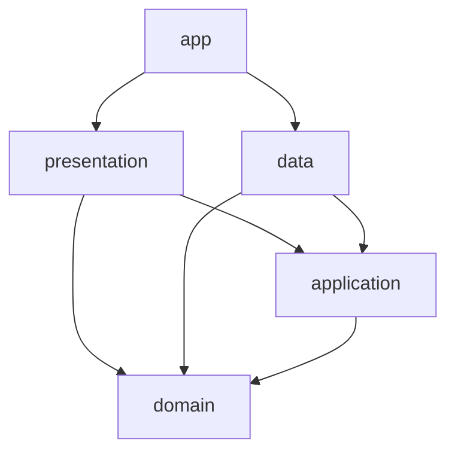

# Architecture

Navigation map for Kiki's Commerce (`kiki_commerce`). This file is about
**where code lives and how the layers depend on each other**. For coding
conventions see [CLAUDE.md](CLAUDE.md); for how to run, configure and deploy see
[README.md](README.md); for why key choices were made see the
[ADRs](docs/decisions/). Keep this file short and stop it from drifting — a wrong
architecture doc is worse than none.

## Stack

- **Flutter** — storefront *and* admin backoffice in one app, mobile-first, also
  runs on web.
- **Riverpod** (`flutter_riverpod`) — state management and dependency injection.
- **go_router** — routing, configured in `lib/app/app_router.dart`.
- **PocketBase** backend, accessed over `http` (no SDK). The default instance is
  **hosted** (`API_BASE_URL`, see README) — there is no local backend to start;
  the app reads live CMS and catalog data over the network.

## Layers and dependency direction

Rule of thumb: **dependencies point toward `domain`**. The UI never talks to
PocketBase directly — it always goes through a repository.

| Directory | Role | Edit it when… |
|---|---|---|
| `lib/domain/` | Plain entities + domain exceptions (`cart_entities`, `catalog_entities`, `cart_exceptions`). | adding a core business type |
| `lib/application/` | Use-case logic, app-level models, and **repository interfaces** (e.g. `application/cms/cms_page_repository.dart`, `application/cart/cart_repository.dart`). CMS section models live in `application/cms/cms_models.dart`. | adding business logic or a repository contract |
| `lib/data/` | Repository **implementations** (PocketBase-backed: `data/repositories/pocketbase_*`), API clients, mappers, DTOs, local stores. | wiring a contract to PocketBase / changing a fetch |
| `lib/presentation/` | All UI — `screens/`, `widgets/` — plus the Riverpod `providers/` the UI watches. | building or altering anything visual |
| `lib/app/` | Bootstrap: root widget `KikiCommerceApp`, `app_router.dart` (GoRouter), `app_providers.dart` (DI wiring). | adding a route or a top-level provider |
| `lib/core/` | Cross-cutting infra: `cache/`, `error/`, `network/`, `utils/`. | shared plumbing |
| `lib/config/` | `ApiConfig` — base URLs and build-time `--dart-define` values. | env / config |
| `lib/admin/` | CMS backoffice, separate from the storefront (`screens/`, `repositories/`, `services/`). | admin tooling |
| `lib/features/` | Isolated / experimental modules kept out of the main tree (e.g. `commercetools_lab`). | spike work |

> ⚠️ The repository pattern is split **application ↔ data**, *not* the textbook
> "interface in domain". Interfaces live in `application/`, PocketBase
> implementations in `data/`. Do not add repository interfaces under `domain/`.

## Bootstrap (`lib/main.dart`)

`main()` → `ApiConfig.assertMediaConfigured()` → path URL strategy → bundle-only
fonts (never fetched at runtime; the HTTP fetch causes a web text reflow) →
**resolve the launch locale before the first frame** (so the app never flashes
the wrong language, notably on web) → `runApp(ProviderScope(overrides: [locale,
contentLocale, urlLocaleOverride], child: KikiCommerceApp))`.

`KikiCommerceApp` builds a `MaterialApp.router`. The GoRouter instance is
created once and **must not be recreated** — recreating it drops navigation
state.

## The CMS-driven landing (most common area of work)

The storefront landing is **data-driven from PocketBase**, not hard-coded:

1. A CMS page is fetched via `CmsPageRepository` (impl
   `data/repositories/pocketbase_cms_page_repository.dart`).
2. It deserializes into the models in `application/cms/cms_models.dart`.
3. `presentation/screens/storefront_landing_page.dart` renders the sections in a
   vertical `ListView.builder`.
4. Each section type maps to a widget in `presentation/widgets/cms/sections/`
   (~14 of them: hero, banner strip, tile/feature carousels, product grids…).

Consequence worth knowing: a section's layout/variant (e.g. the tile carousel's
`'tiles'` vs `'feature'`) is set **per CMS record**. A variant only appears on
screen if a CMS section is configured for it — it is not a code default, so you
cannot assume it renders just because the code path exists.

## Localization

FR / EN. Storefront copy is partly legacy CMS text localized at render time via
`localizedLegacyCmsText`; generated ARB strings live under `lib/l10n/` and
`lib/presentation/l10n/`. The locale is resolved at launch (see Bootstrap) and
reflected in the URL (`/fr`, `/en`).
