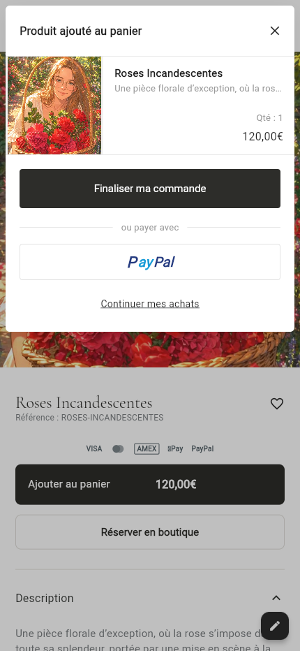
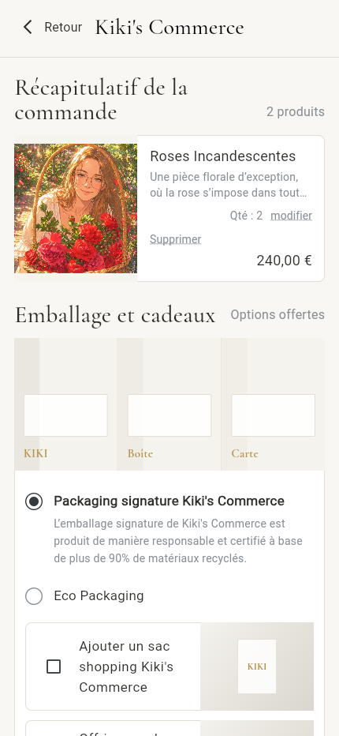
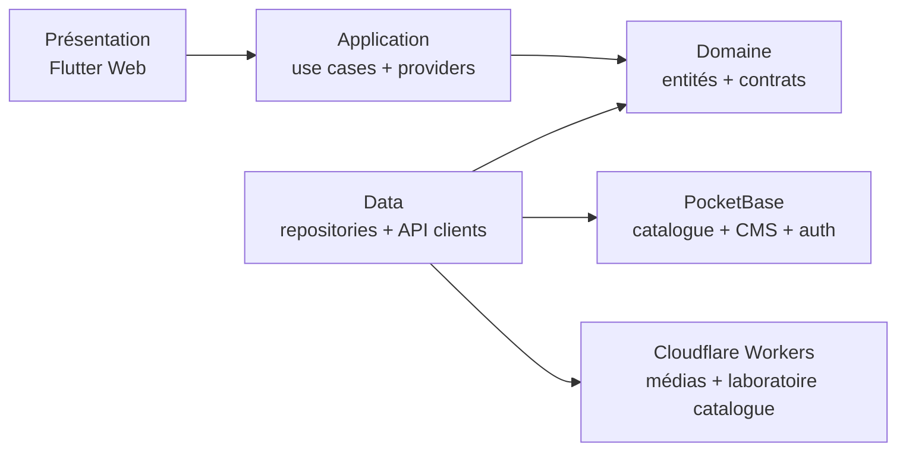

# Kiki Commerce

Une expérience e-commerce éditoriale construite avec **Flutter Web**, pilotée
par un CMS PocketBase et déployée sur Cloudflare.

[Voir la démo](https://kikicommerce.com) ·
[Explorer l’architecture](ARCHITECTURE.md) ·
[Lire l’audit performance](docs/audit_jank.md)


## En un coup d’œil

| | |
|---|---|
| **Frontend** | Flutter Web, Dart, Riverpod, GoRouter, rendu skwasm |
| **Backend** | PocketBase, migrations versionnées, hooks JavaScript |
| **Edge** | Cloudflare Pages et Workers, proxy média avec cache |
| **Contenu** | Storefront et navigation pilotés par CMS, français et anglais |
| **Qualité** | 1 409 tests Flutter, 31 tests JavaScript, analyse statique stricte |
| **Périmètre** | Storefront, catalogue, PDP, panier, checkout UI et backoffice |

> Projet personnel end-to-end : architecture, expérience utilisateur,
> intégration backend, outillage éditorial, performance web et déploiement.

## Ce que démontre le projet

- **Un storefront réellement administrable** : pages, sections, navigation,
  médias, produits et traductions se modifient sans redéployer le frontend.
- **Une architecture maintenable** : les responsabilités UI, application,
  domaine et accès aux données sont séparées et testées indépendamment.
- **Une attention poussée à la performance** : listes lazy, préchargement
  d’images ciblé, déduplication des requêtes, isolation des repaint et
  animations adaptées au mode de mouvement réduit.
- **Une expérience responsive travaillée** : parcours distincts desktop et
  mobile, transitions PDP, navigation immersive et interactions panier.
- **Un backoffice intégré** : import/export CSV, médiathèque, édition des
  collections et prévisualisation des contenus.
- **Une infrastructure reproductible** : schéma PocketBase versionné,
  Workers testés et builds web release contrôlés.

## Aperçus du parcours mobile

<p align="center">
  
  
</p>

## Architecture



Le projet suit une architecture en couches avec dépendances dirigées vers le
domaine. Riverpod assure l’injection et la gestion d’état ; les repositories
isolent PocketBase et les services externes du reste de l’application.

Pour comprendre les choix structurants :

- [Carte complète de l’architecture](ARCHITECTURE.md)
- [Pourquoi Riverpod](docs/decisions/adr-001-riverpod.md)
- [Pourquoi PocketBase](docs/decisions/adr-002-pocketbase.md)
- [Modèle de sections CMS](docs/decisions/adr-003-cms-section-model.md)

## Points techniques remarquables

### Storefront piloté par CMS

Les pages publiques sont composées de sections ordonnées et typées. Le moteur
de rendu transforme leur configuration PocketBase en widgets spécialisés :
hero campaigns, carrousels, grilles de produits, tuiles de catégories,
chapitres narratifs et segments de marque.

### Panier guest fiable

Le chemin principal utilise des routes PocketBase dédiées avec transaction et
clé d’idempotence. Les lectures locales sont mises en cache et les mutations
restent synchronisées avec l’interface, y compris pendant les animations
d’ajout au panier.

### Performance web mesurée

La production utilise **dart2wasm + skwasm**. Les surfaces sensibles suivent
des règles explicites : aucune lecture géométrique coûteuse par frame, images
above-the-fold préchargées, longues listes construites paresseusement et
animations non essentielles désactivées lorsque l’utilisateur le demande.

- [Méthode de profilage](docs/dev/storefront_performance_profiling.md)
- [Sécurité du cycle de vie skwasm](docs/dev/skwasm_gpu_resource_disposal.md)
- [Performance des shaders](docs/dev/shader_animation_performance.md)

### Administration et contenu

Le backoffice accessible sous `/admin` permet de gérer le catalogue et le CMS,
d’importer un catalogue CSV, d’optimiser les médias avant upload et d’éditer les
traductions. Les changements de schéma passent par des migrations PocketBase
versionnées.

## Lancer le projet

### Prérequis

- Flutter 3.44.4 ou version compatible
- Dart 3.11+
- Chrome

### Développement

```bash
flutter pub get
flutter run -d chrome
```

La configuration de développement utilise par défaut l’instance PocketBase de
démonstration. Les origines peuvent être remplacées avec des
`--dart-define`.

| Variable | Valeur par défaut | Rôle |
|---|---|---|
| `API_BASE_URL` | `https://kiki-commerce.pockethost.io` | API PocketBase |
| `MEDIA_BASE_URL` | fallback sur l’API | CDN public des médias |
| `USE_CART_ADD_ENDPOINT` | `true` | Route panier transactionnelle |
| `ENABLE_NAVBAR_SHADERS` | `false` | Effets GPU expérimentaux de navigation |

### Build web de production

```bash
flutter build web --release --wasm \
  --dart-define=API_BASE_URL=https://kiki-commerce.pockethost.io \
  --dart-define=MEDIA_BASE_URL=https://kikicommerce.com/img
```

## Qualité

```bash
flutter analyze --fatal-infos --fatal-warnings
flutter test
dart format --output=none --set-exit-if-changed lib test

node --test \
  test/pocketbase/cart_add_item_hook_test.js \
  test/pocketbase/cart_clear_hook_test.js

cd workers/kiki-ct-catalog-proxy
npm ci
npm test
```

État du snapshot publié :

- analyse Flutter sans erreur ni avertissement ;
- **1 409 tests Flutter** réussis ;
- **9 tests PocketBase** et **22 tests Worker** réussis ;
- build web release skwasm réussi.

## Structure du dépôt

```text
lib/
├── presentation/   écrans, widgets et providers UI
├── application/    cas d’usage et ports
├── domain/         entités et règles métier
├── data/           repositories et clients API
├── admin/          backoffice catalogue et CMS
└── features/       expérimentations isolées

pocketbase/
├── pb_migrations/  schéma et évolutions versionnées
└── pb_hooks/       routes serveur du panier

cloudflare/          proxy média edge
workers/             intégrations Worker isolées
test/                tests unitaires, widgets et intégration
```

## État et limites connues

- Le checkout présente le parcours et ses états UI ; aucun paiement réel n’est
  déclenché.
- Le connecteur commercetools reste un laboratoire isolé du catalogue
  principal.
- Un incident skwasm mobile est documenté et suivi :
  [empty-PLP → Home](docs/incidents/2026-07-09-skwasm-paragraph-relayout-freeze.md).
- Les collections CMS publiques ne doivent contenir aucune donnée sensible.

## Documentation

- [Schéma PocketBase](docs/pocketbase-schema.md)
- [Navigation PLP/PDP](docs/plp_parent_navigation.md)
- [Changement de thème storefront](docs/storefront_theme_switch.md)
- [Usage des API Flutter](docs/flutter-api-usage.md)

---

Conçu comme un démonstrateur de commerce composable, avec une priorité donnée à
la qualité de l’expérience, à la lisibilité de l’architecture et à la mesure
des performances.
